# 영속성 컨텍스트


## 동작방식

### 1. persiste, find
* 영속성 컨텍스트는 entitymanager 단위로 관리.
* persist() 를 통한 영속객체 등록은 우선 해당 객체가 1차 캐시에 저장되고 일반적으로 트랜잭션이 커밋되는 시점에 insert 쿼리가 db에 반영
* find() 를 통한 데이터 검색은 우선 1차 캐시를 통해 해당 객체를 검색, 없을 경우 select 쿼리를 통해 db에서 검색 수행.
  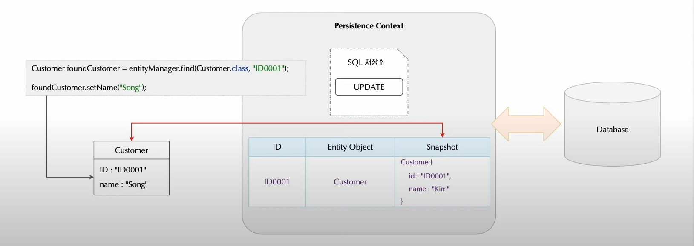

### 2. update
* 영속 컨텍스트를 통해 관리되는 영속 객체는 객체의 상태 변경에 따라 update 쿼리가 생성되고 커밋 시점에 데이터베이스에 반영됨.
* 객체의 변경사항은 1차 캐시의 스냅샷 정보를 통해 판별
* 영속 객체의 상태가 변경되면 1차 캐시의 스냅샷과 비교하고 다를 경우 update쿼리를 생성, sql 저장소에 저장


### 3. flush
* 플러시는 영속성 컨텍스트의 내용을 데이터베이스와 동기화 하는 것을 의미.
    * commit이 되기전까지 영속성 컨텍스트의 내용이 db에 저장되지 않음
    * 트랜잭션의 commit() 이 발생하기 직전에 한번 이루어짐.
* 플러시의 3가지 방식
    * entityManager.flush() 직접 호출을 통한 플러시
    * 트랜잭션의 커밋을 통한 자동 플러시
    * jqpl 쿼리 실행을 통한 자동 플러시
      영속성 컨텍스트에만 관리되고 있는 영속 상태의 엔티티들은 사실상 DB에 존재하지 않으므로 JPQL을 통한 Query 요청 시 결과에서 이 것들을 확인할 수 없게 된다. 이를 방지하기 위해 미리 Flush()를 호출하여 DB에 반영한 뒤 정상적인 결과를 제공하게 된다.

* 플러시를 실행한 이후에도 영속성 컨텍스트의 내용은 그대로 유지.
* 사용 예)
    * em.persist(customer01) 을 한후 select list 쿼리를통해 전체 리스트를 조회해 올때, customer01 에 대한 데이터는 조회해올수 없다 (실제 db에 반영되지 않았기 때문에)
    * 따라서 중간에 flush를 통해 db와 영속성간 동기화를 진행해준 후에 select list 를 통해 조회 해올 수 있다.

```java

        try {
			entityManager.persist(new Customer("id8", "bowon", System.currentTimeMillis())); // 영속성 컨택스트(1차 캐시) 에 먼저 저장

			// jpql을 만들때에는 entity maneger의 flush() 가 자동으로 선행된다.
			Query query = entityManager.createQuery("SELECT c FROM Customer c", Customer.class);
			List<Customer> customers = query.getResultList();
			System.out.println(customers);


			// entityTransaction.commit(); // db에 기록
		} catch (Exception exception) {
			entityTransaction.rollback();
		} finally {
			entityManager.close();
		}
		entityManagerFactory.close();


```
* 결과:db에 잇는 customer 들과 id8 까지 모두 노출됨, 그러나 실제 db에는 id8 은 없음, commit 하지 않았기 때문.

Entity 생명주기
---
* 영속 객체의 상태는 4가지 상태로 구분
    * 비영속(New): 영속성 컨텍스트로 관리되기 이전 순수 객체 상태
    * 영속(Managed): 영속성 컨텍스트로 등록되고 관리되는 상태.
    * 준영속(Detached): 영속성 컨텍스트의 관리에 있다가 분리된 상태 (Managed -> detached)
    * 삭제(Removed): 영속 데이터의 삭제를 위한 상태(EntityManager.remove())
      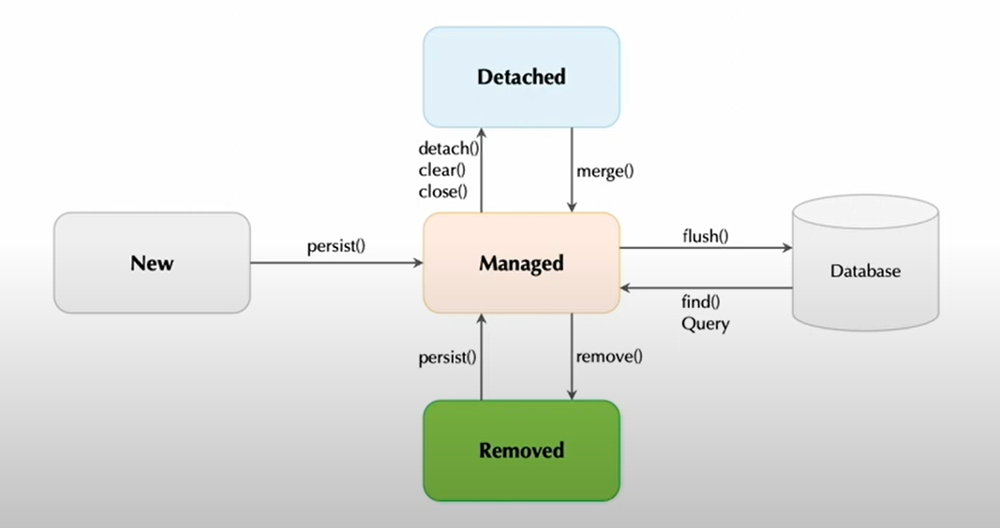


```java
try {
			Customer customer = new Customer("id9", "bowon", System.currentTimeMillis()); // 비영속 상태 (new)

			entityManager.persist(customer); // 영속성 컨택스트(1차 캐시) 에 먼저 저장 ( 영속 상태 )
			entityManager.detach(customer); // customer 객체를 준 영속 상태로 만듬.
			Customer foundCustomer = entityManager.find(Customer.class, "id9");
			
			System.out.println(foundCustomer);
			
			entityTransaction.commit(); // db에 기록
		} catch (Exception exception) {
			entityTransaction.rollback();
		} finally {
			entityManager.close();
		}

```
* 결과: db에 가서 id9 조회를 진행하게 됨 왜냐면 준 영속 상태이기 때문에 영속 컨텍스트에서 조회해오지 못함.

# Entity 맵핑

## @Entity
* 도메인 객체를 관계형 데이터 베이스 테이블로 맵핑할 때 @Entity 어노테이션을 사용
* @Entity 어노테이션만 선언했을 때 테이블 이름은 클래스 이름이 되고 대/소문자 치환은 일어나지 않음
* 대부분은 RDBMS는 대/소문자를 가리지 않으므로 기본 JPA작명규칙이 문제를 발생하지 않음
* @Table 어노테이션을 사용해서 테이블 이름을 명시적으로 표기할 수 잇음.

### 영속 객체가 되기 위한 조건들
* 디폴트 생성자
* final 클래스는 안됨
* final 키워드는 사용하지 못함.

## @Table
* 관습적인 테이블 설계 방법에서 테이블 이름은 대문자에 "_" 를 많이 사용
* @Table 어노테이션은 스키마를 지정하거나 테이블 이름을 구체적으로 명시 (schema, catalog가 다를경우 지정 필요)
* 특정 RDBMS는 스키마 지정을 테이블 이름에 포함할 수 있기에 "SA.USER" 로 스키마 지정 가능
* @Table(name="USER", catalog="CATALOG") 로 카탈로그 지정이 가능
  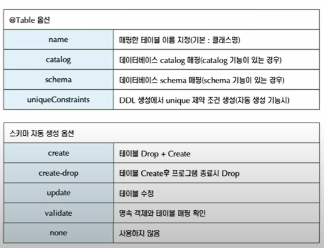

## @Access
* Jpa에서 객체에 대한 접근 방식은 크게 필드 접근방법과 프로퍼티 접근방법 (getter/setter) 으로 구분.
* @Access를 적용하지 안을 경우 @Id 어노테이션의 지정 위치에 따라 접근 방법을 결정할 수 있음.
* @Access 어노테이션을 선언해서 명시적으로 접근 방법을 설정할 수 있슴.
* @Access 어노테이션으로 필드/속성 접근 방법을 동시에 사용할 수도 있음.

## @Id
* 기본키 적용을 위한 어노테이션
* !!! float, Float, double, TimeStamp 타입을 피해야함 !!!
* 기본키 값을 자동 생성하기 위해서는 @GeneratedValue 어노테이션을 적용.
* Identity 전략은 새로운 데이터가 생성될 때 그 값이 부여, 따라서 데이터 저장을 위해 persist() 호출 시점에 Insert가 진행됨.
* Identity 기본키 생성 전략을 통해 Insert를 하면 해당 기본키 데이터는 저장이 된후 영속성 객체에 저장된다?
  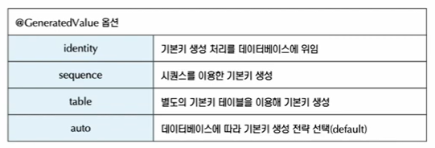

```java
@Entity
@Table(name="customer")
@AllArgsConstructor
@NoArgsConstructor
@Getter
@Setter
@ToString
public class Customer {
	@Id
	@GeneratedValue(strategy = GenerationType.IDENTITY)
	private String id;
	private String name;
	@Column(name = "register_date")
	private long registerData;
}
```

```java
                entityTransaction.begin();

		Customer customer = new Customer();
		customer.setName("kiny");
		customer.setRegisterData(System.currentTimeMillis());
		
		try {
			entityManager.persist(customer); //

			System.out.println("-- before commit -- ");

			entityTransaction.commit(); // db에 기록
		} catch (Exception exception) {
			entityTransaction.rollback();
                } finally {
                            entityManager.close();
                }
		entityManagerFactory.close();
```
* commit이 아닌 persist 시점에 generated Id를 알기 위해 insert 가 진행이 됨.


## @SequenceGenerator Sequence 기본키 생성 전략
* sequence 생성 전략은 데이터베이스의 sequence 오브젝트를 이용해 기본키를 생성하는 방식
* sequence 오브젝트를 제공하는 Oracle, PostgreSQL, DB2 등에서 적용 가능
* @SequenceGenerator가 필요하며 여러 옵션 적용 가능
* Idntity 전략과 마찬가지로 데이터가 발생할 때 생성되는 Sequence를 받아 영속 객체를 관리
```java
@Entity
@Table(name="customer")
@AllArgsConstructor
@NoArgsConstructor
@Getter
@Setter
@ToString
@SequenceGenerator(name="customer_generator", sequenceName = "customer_seq", initialValue = 1, allocationSize = 50)
public class CustomerWithSequence {
	@Id
	@GeneratedValue(strategy = GenerationType.SEQUENCE, generator = "customer_generator")
	private String id;
	private String name;
	@Column(name = "register_date")
	private long registerData;
}

```
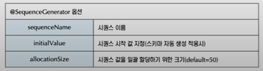
* @SequenceGenerator 를 통해 시퀀스 생성
* @GeneratedValue 를 통해 생성한 시퀀스를 적용.
* insert를 실행할때 select 문을통해 시퀀스를 조회하여 영속객체에 저장 후, commit이 이루어 질때 해당 영속객체의 sequence 값을 가지고 insert가 이루어짐.

## @TableGenerator Talbe 기본키 생성전략
* 기본키 생성을 위해 별도의 테이블을 생성하고 이 테이블을 이용해 기본키를 생성.
* Table 기본키 생성 전략은 별도의 테이블을 생성하기 때문에 데이터베이스 종류에 영향을 받지 않음
* Table생성 전략은 테이블 생성과 키값 증가를 위한 update가 실행되기 때문에 성능에 대한 고려가 필요.
  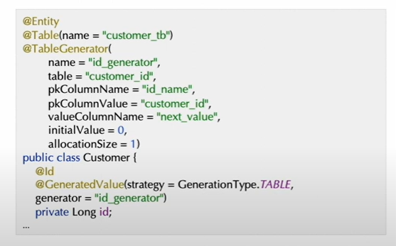

## 필드와 컬럼 매핑

### @Column
* Column 어노테이션은 영속 객체의 필드와 데이터베이스 테이블의 컬럼을 매핑할때 사용
* Column 어노테이션이 없으면 하이버네이트의 경우 기번적으로 @Basic 어노테이션이 붙는거와 같다.
  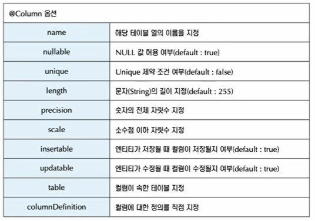

### @Temporal
* Temporal 어노테이션은 영속 객체의ㅣ 날짜 및 시간 필드에 적용
* 자바의 날짜 및 시간 정보는 년,월,일과 시,분,초를 하나의 필드로 표현할 수 있지만 데이터베이스에 따라 날짜, 시간, 날짜와 시간 컬럼의 타입이 다르기 때문에 이를 @Temporal 어노테이션으로 지정할 수 있다.
  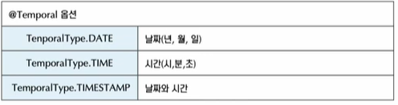

### @Lob
* RDBMS에서 대규모 데이터를 저장하기 위해 BLOB, CLOB 데이터 유형을 지원.
* @Lob 어노테이션이 선언된 객체의 필드 및 속성의 유형에 따라 BLOB, CLOB 이 구분된다.
  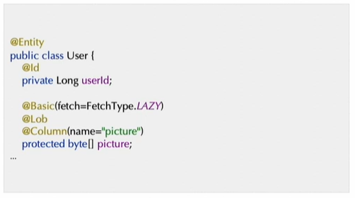
* (FetchType.LAZY란?)
    * Lazy가 있을경우 em.find() 를 통해서 조회해오는 시점에는 데이터를 가져오지 않고 해당 객체의 필드를 사용할때 가지고 오게 됨.

### @Enumerated
* 열거형 유형을 정의
* Enum 유형으로 선언된 배열과 동일하게 ordinal 이라 부르는 인덱스 값에 연결됨.
* Enum 유형의 필드 또는 속성을 맵핑하는 경우 기본값으로 EnumType.ORDINAL 이 적용됨
* DB에 없는 열겨형 타입을 java와 맵핑하기 위해 사용.
  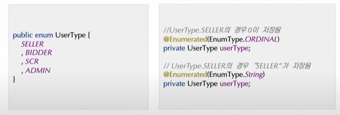
* EnumType
    * ORDINAL 열거형 배열의 인덱스가 저장 (거의 사용 안함)
    * String 열거 배열 값의 이름이 저장됨.

### @Translent
* 이 어노테이션이 적용된 필드는 영속화 되지 않음
* 주로 실행 시점에 참조되는 필드 또는 계산되는 필드에 사용.
* @translent 어노테이션 또는 transient 키워들 사용할수 있음.
  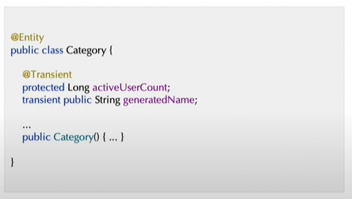

## 관계 매핑 기본

### 연관 관계
* 양방향 관계는 되도록 많들지 않음.
* 연관관계가 만들어져있는 객체에 변화가 일어나면 다른 객체에도 영향을 끼친다.
* 관계를 구성할때, 관계에 대한 사이드 이펙트를 반드시 고려해야함.
* 객체는 참조테이블의 ID 가 아닌 실제 객체를 가지고 있는 형태여야 한다. (아래 사진 참고)
  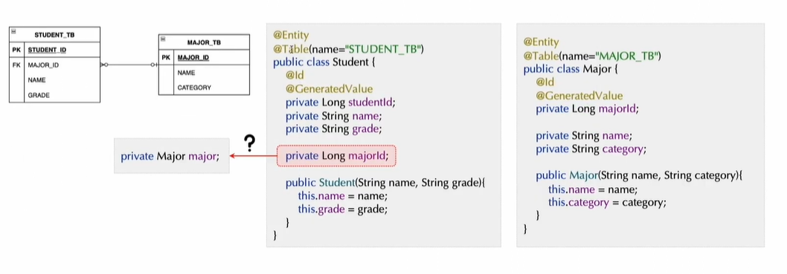